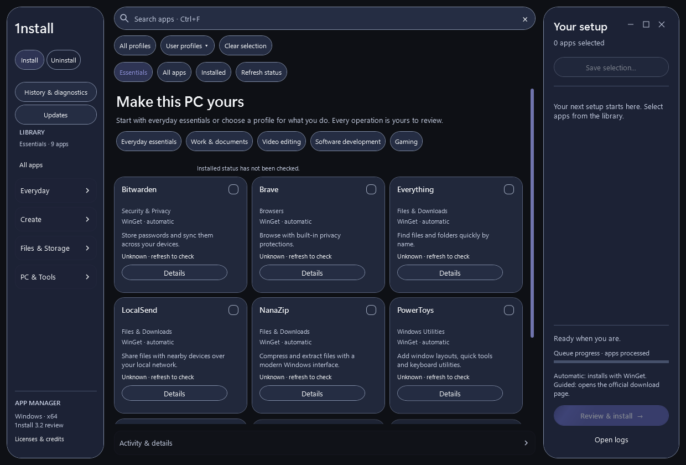
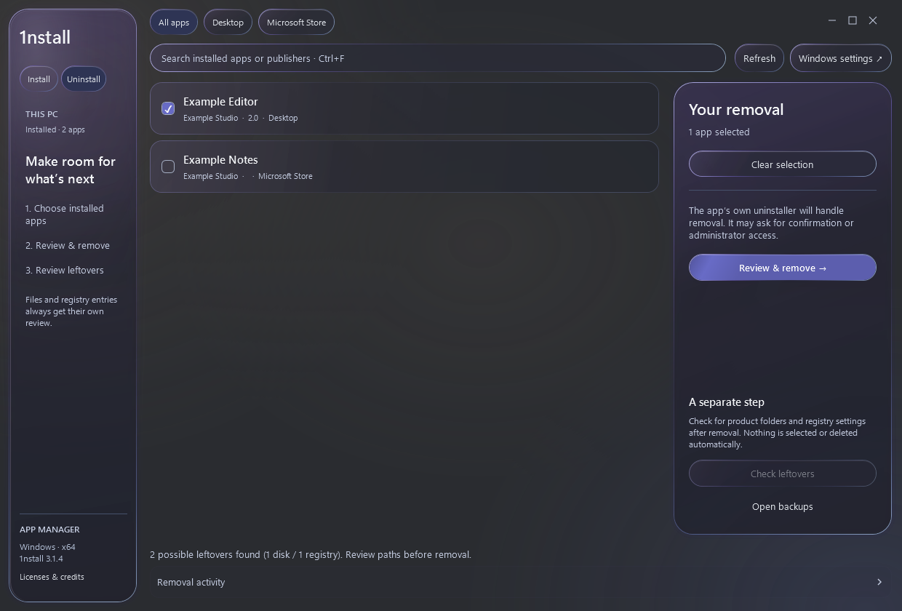
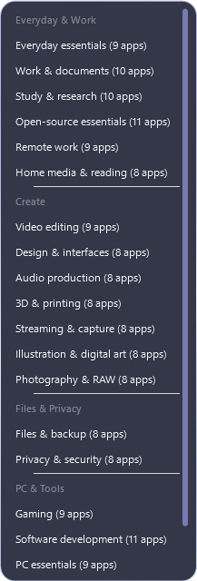
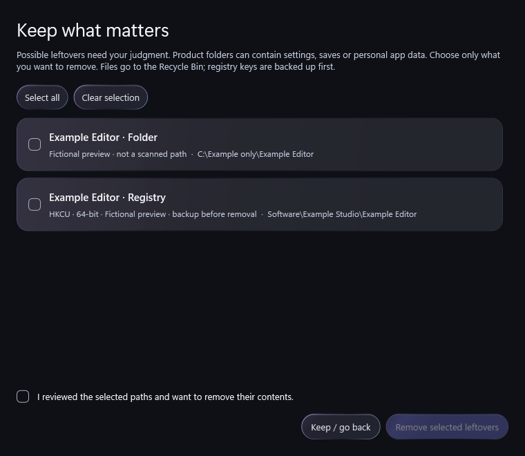

# 1nstall

A Windows app manager for choosing, installing and removing your software. Browse a task-based library, start with a tailored profile, and review each operation before it runs.

**325 apps · 24 categories · 20 profiles**

**Version 3.2.0-review · Windows x64 · public prerelease**

[Download the 3.2.0-review prerelease](https://github.com/braga1k/1nstall/releases/tag/v3.2.0-review), with installed awareness, an Update Center, portable setup snapshots and operation history. The stable download links below remain on 3.1.4. This prerelease is unsigned; isolated installer and native desktop tests are deferred. See [validation evidence](docs/VALIDATION.md), [release notes](docs/releases/3.2.0-review.md) and [release review](docs/RELEASE-REVIEW.md).

[**Download 1nstall.exe**](https://github.com/braga1k/1nstall/releases/latest/download/1nstall.exe) · [Windows ZIP](https://github.com/braga1k/1nstall/releases/download/v3.1.4/1nstall-3.1.4-Windows-x64.zip) · [Release notes](https://github.com/braga1k/1nstall/releases/tag/v3.1.4) · [Checksums](https://github.com/braga1k/1nstall/releases/download/v3.1.4/SHA256SUMS.txt)



## A library that makes sense

Applications are organized by what you want to do. Video players and video editors have separate categories; tools with several uses can appear in more than one category without being installed twice. Start in **Essentials**, choose a task profile, or reach **All apps** in one click. Your preferred library view is remembered; search reaches the whole catalog. Cards show a description, installation method and Installed / Not installed / Unknown status. Details are available with their button or F1 on a focused card.

- **Install:** 277 applications use WinGet; 48 open their official download page for guided installation. Select apps, adjust Your setup, then review the plan before starting.
- **Profiles:** choose from 20 setups containing 8-11 complementary apps each. All profiles stays in a dropdown; User profiles saves and loads your own portable selections.
- **Uninstall:** find registered desktop and current-user Microsoft Store apps, filter by source or publisher, review a batch and run the original uninstallers in sequence.
- **Updates:** check known versions, select exact packages and review before running. Holds apply in 1nstall only; WinGet pins are separately respected, including individual upgrades. Stop waits for the current installer. Failed items require a fresh check before retry.
- **Snapshots:** User profiles can save reliably identified installed packages, then preview already installed, missing, unavailable and manual entries on another PC. Existing selection profiles remain compatible. A snapshot does not back up personal files, app settings or credentials and does not guarantee identical versions.
- **History & diagnostics:** timestamped per-app outcomes, detailed logs, applicable retries and a redacted diagnostic preview you can save yourself. No sharing happens automatically.
- **Leftovers:** a separate review shows verified disk folders and executable-path registry values after removal. Select individual items or Select all, then explicitly confirm cleanup. Registry changes require backups; folders go to Recycle Bin.
- **Appearance:** a quiet gradient, glass controls, Segoe UI Variable typography and a background that adapts to your Windows accent. Desktop Acrylic reflects real content behind the window on supported Windows 11 builds.

Windows transparency and reduced-motion preferences are respected. Missing WinGet and unsupported uninstallers have clear routes to Windows Settings or the official installer.

## Get started

1. [Download **1nstall.exe**](https://github.com/braga1k/1nstall/releases/latest/download/1nstall.exe), or extract the Windows ZIP, and open the app.
2. Choose apps or a profile under **Install**, then adjust the selection in **Your setup**.
3. Choose **Review & install**, check the apps and terms, and start the queue. Complete any guided downloads yourself.
4. To remove software, open **Uninstall**, select apps and choose **Review & remove**. After removal, review any detected leftovers separately.

The executable includes the interface, catalog, native helpers and license notices. Running it does not require Python, Zig or the source folder. It is currently unsigned; verify your download using the release checksums.

### Requirements

- Windows 10 or Windows 11, **64-bit**. This review was checked on Windows build 26100; see the environment and untested cases in [VALIDATION](docs/VALIDATION.md).
- Windows PowerShell 5.1, WPF and .NET Framework 4.x.
- WinGet from Windows App Installer for automatic installations.
- Full installed inventory and Update Center require PowerShell 7 at its standard Program Files location and Microsoft.WinGet.Client 1.7 or later. Install these prerequisites yourself. Structured WinGet export can confirm some installed identities without them; omitted apps remain Unknown. Update discovery has no localized upgrade-table fallback.
- Internet access for application downloads. Individual installers or machine-level removals can request administrator access.

Native Desktop Acrylic requires Windows 11 22H2 or later. Older systems and disabled transparency use opaque surfaces. Windows 10, high-contrast themes and large text scaling need broader validation.

## Profiles for what you do

| Group | Profiles |
| --- | --- |
| Everyday & Work | Everyday essentials, Work & documents, Study & research, Open-source essentials, Remote work, Home media & reading |
| Create | Video editing, Design & interfaces, Audio production, 3D & printing, Streaming & capture, Illustration & digital art, Photography & RAW |
| Files & Privacy | Files & backup, Privacy & security |
| PC & Tools | Gaming, Software development, PC essentials, Web development, Game development |

Each menu entry shows an app count; hover to see its purpose and included apps. Choosing a profile replaces the selection and leaves it ready to review. It never starts installation.

Save a selection with **Your setup > Save selection...** or **User profiles > Save current selection...**. Use **User profiles > Load saved profile...** on another PC to restore it. Existing saved profiles remain compatible when their application keys are present in the current catalog.

[Explore all profile selections](docs/PROFILES.md) · [Supported applications](docs/SUPPORTED-APPS.md) · [Category review](docs/CATEGORY-REVIEW.md)

## Remove apps and review leftovers

The removal workflow reads registered desktop apps and removable Store packages for your user. Missing or unsupported uninstallers point to Windows Settings. Stop waits for the current app to finish before stopping the queue.

Post-removal scanning offers only a freshly recorded installation location and exact executable-path trace values after removal and ownership have been verified. Similar names, old history and uncertain ownership do not authorize cleanup. A review identifies disk and registry counts, and nothing is selected automatically. You can also check leftovers from recent removals later.

Personal documents, protected Windows locations, broad vendor roots, shared registrations and links are excluded. Restart-dependent cleanup waits until after a later boot. Registry exports and restore instructions are available under **Open backups**; recycled folders can be restored through Windows Recycle Bin. Detection is bounded and does not promise to find every trace left by every program.



<details>
<summary>Preview the profile menu and leftover review</summary>





</details>

[Removal scope and recovery](docs/UNINSTALL.md)

## What's new in 3.2.0-review

This unpublished review extends the public 3.1.4 release.

- Recursive dependency ordering; failed or unverified dependencies block dependents.
- Exact package commands, background inventory and verified per-app outcomes.
- Welcoming Essentials, installed library, details, Update Center, snapshots and diagnostics.
- Fail-closed update exclusions and narrower cleanup ownership rules.
- Headless Windows CI, signing support, checksums and source-input build metadata.

The established 3.1.4 features are retained:

- Complete rebrand, revised category structure and a glass interface with native desktop transparency and accent-aware contrast.
- New desktop/Store uninstall workflow, post-removal leftover review, registry backups and folder recycling.
- Expanded profile selections: 20 tailored setups in the original dropdown interaction.
- Seamless window controls, text-only wordmark, cleaner Uninstall header and a quiet gradient background.
- Search hints disappear on focus; checkbox centers respond to clicks; installed-app scanning keeps a dark background without the previous white flash.

[Full changelog](CHANGELOG.md)

## Run or build from source

Download the repository with **Code > Download ZIP**, extract it, and double-click `script_allower.cmd`. Alternatively, from the source folder:

```powershell
powershell.exe -NoProfile -STA -ExecutionPolicy Bypass -File .\vexan_installers.ps1
```

Keep `catalog.json`, `profiles.json`, `interface.xaml` and `src/` beside the script. The execution-policy option applies only to that process and does not change saved Windows policies.

To build the standalone executable:

```powershell
powershell.exe -NoProfile -ExecutionPolicy Bypass -File .\build-windows.ps1
```

The tested Windows builder uses the .NET Framework compiler included with Windows and writes `dist/1nstall.exe`. `build.py` is retained as an alternative Python/Zig path. Rebuild when changing any embedded source, catalog, profile, interface, icon or license notice.

## Validation

```powershell
py -3.14 tests/catalog.py
powershell.exe -NoProfile -STA -ExecutionPolicy Bypass -File .\tests\reliability.ps1
powershell.exe -NoProfile -STA -ExecutionPolicy Bypass -File .\vexan_installers.ps1 -ManagerTest -PreviewPath after.png
powershell.exe -NoProfile -STA -ExecutionPolicy Bypass -File .\tests\smoke.ps1
powershell.exe -NoProfile -STA -ExecutionPolicy Bypass -File .\tests\backdrop.ps1
powershell.exe -NoProfile -STA -ExecutionPolicy Bypass -File .\tests\uninstall.ps1 -DisposableEnvironment
```

The executable also accepts `--self-test`, `--smoke-test` and `--manager-test`, writing results beside itself. Only self-test and reliability checks belong in headless CI. Run backdrop and native cleanup fixtures in an isolated interactive VM; the `-DisposableEnvironment` switch explicitly declares that environment. Catalog checks cover 325 apps, 24 categories, 20 profiles and 911 research rows. WPF checks cover four widths, selection/dependencies, profile save/load, search and category layouts, checkbox hit testing, disabled-list backgrounds, window controls, native frame state, contrast and fresh cleanup consent.

The compositor test uses its own white/black backing windows. Native uninstall tests (not run in this review environment) modify newly created disposable fixtures, export registry backups and verify a recycle/restore round trip; they never remove a real third-party app. Publisher uninstallers, Store removal, HKLM elevation, pending restarts and all catalog installations need broader end-to-end coverage. UI previews use fictional removal entries. Actual compositor, native keyboard navigation, high contrast and per-monitor scaling still need interactive verification. See [the complete evidence matrix](docs/VALIDATION.md).

## Troubleshooting

| Problem | What to check |
| --- | --- |
| Automatic installation is unavailable | Install or update Windows App Installer, then reopen 1nstall. |
| An application fails to install or remove | Inspect Activity & details or Removal activity. |
| A guided app was not installed | Complete the official download and installer opened by the app. |
| No leftovers are offered | The scan may have found no supported residue. Check the reported disk/registry counts; detection is limited to documented providers. |
| A saved profile cannot load | Its application keys must exist in this catalog; an invalid import preserves your current selection. |
| The app cannot start | Check `%TEMP%\1nstall-startup-error.log`. |

Logs are in `%LOCALAPPDATA%\1nstall\Logs`; backups are in `%LOCALAPPDATA%\1nstall\Backups`. Use **History & diagnostics > Review diagnostic export** to review redacted summary data before saving or sharing. Raw detailed logs are excluded; inspect those separately for sensitive information.

## Contributions and credits

[Report an issue](https://github.com/braga1k/1nstall/issues) with your Windows/app version and reproduction steps. Application suggestions should include an official website, installation method, license and task category.

The catalog takes inspiration from [Chris Titus Tech's WinUtil](https://github.com/ChrisTitusTech/winutil); [recorded coverage](docs/WINUTIL-COVERAGE.json) describes the reviewed snapshot. The [category comparison](docs/CATEGORY-COVERAGE.csv) is a researched shortlist, not a measured usage ranking; unverified leads are marked separately.

Installation uses [Microsoft WinGet](https://github.com/microsoft/winget-cli). Selected AppCompat/UserAssist scanners and ROT13 handling are adapted from [Bulk Crap Uninstaller](https://github.com/BCUninstaller/Bulk-Crap-Uninstaller) under Apache-2.0, with full license, upstream NOTICE and modification attribution in [licenses](licenses/THIRD-PARTY-NOTICES.txt) and embedded **Licenses & credits**. 1nstall does not reproduce every BCU provider or feature.

Third-party apps retain their own licenses and account requirements. The project does not currently declare a general license for its original code.
