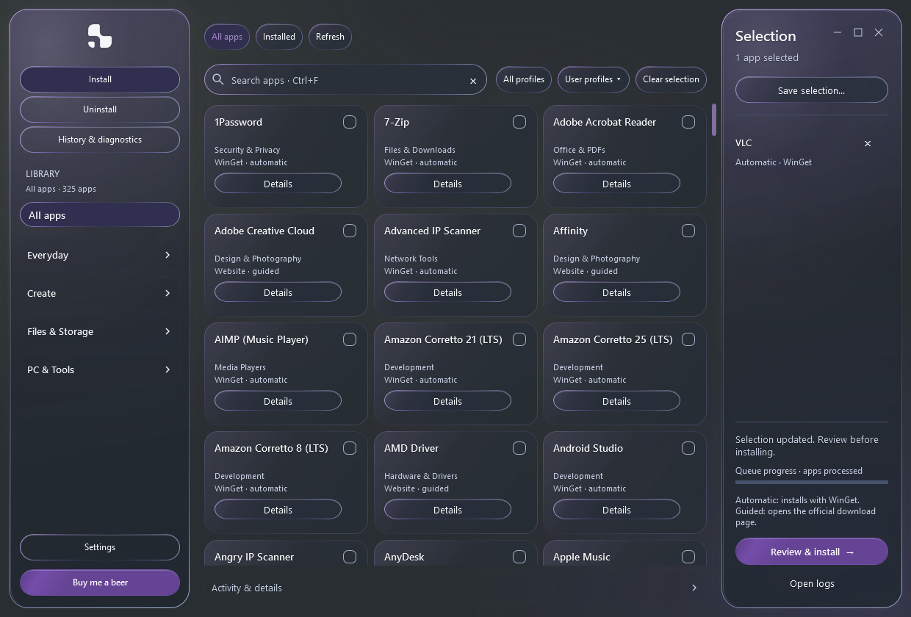
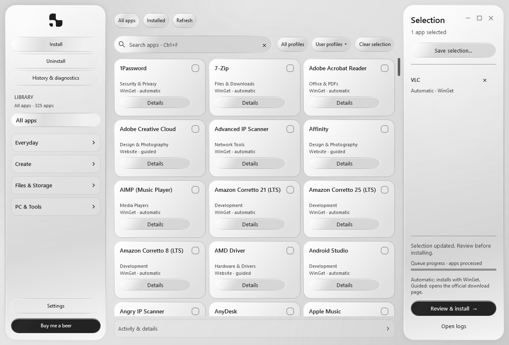
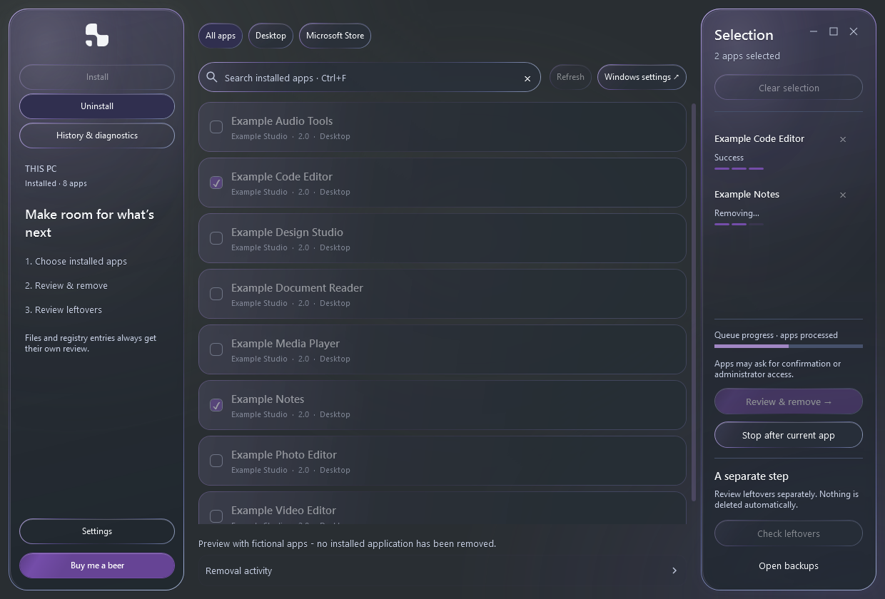
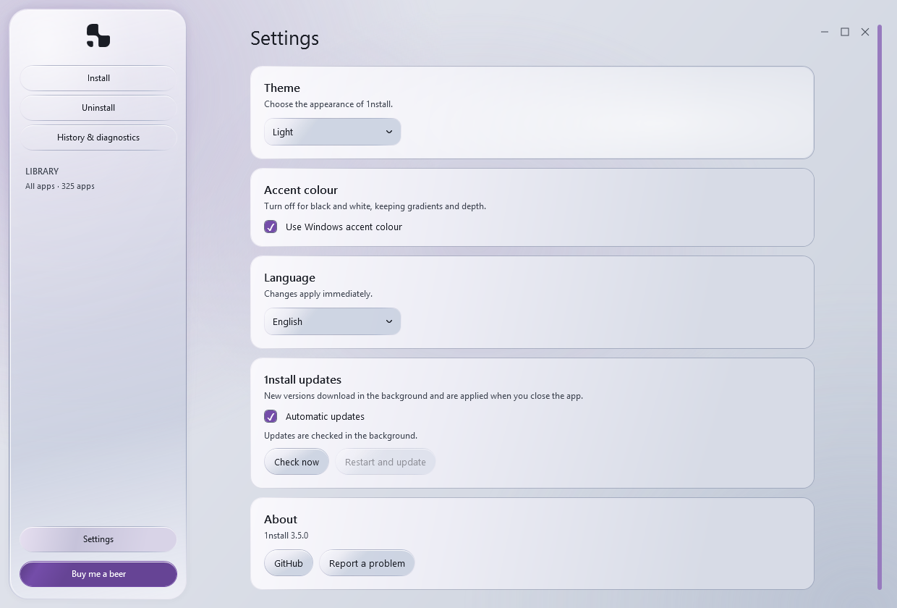

# 1nstall

### Your next Windows setup starts here.

Choose the apps you need, build a setup that fits your work, and keep every installation and removal in view. A Windows app manager with a curated library, reusable profiles and a little delight in the details.

**325 apps · 24 categories · 20 profiles · 51 language choices**

[**Download for Windows**](https://github.com/braga1k/1nstall/releases/latest/download/1nstall.exe) · [Portable ZIP](https://github.com/braga1k/1nstall/releases/download/v3.5.0/1nstall-3.5.0-Windows-x64.zip) · [What's new in 3.5](https://github.com/braga1k/1nstall/releases/tag/v3.5.0) · [Checksums](https://github.com/braga1k/1nstall/releases/download/v3.5.0/SHA256SUMS.txt)

Windows 10 / 11 · x64 · Standalone executable



## A setup that feels like yours

| Choose | Make it yours | Stay in control |
| --- | --- | --- |
| Browse by task, search the library or start from one of 20 profiles. | Light, dark or system appearance. Your Windows accent, or pure monochrome. | Review each queue before it starts. See individual outcomes and open the details when you need them. |
| Save a selection and take it to another PC. | 51 language choices, including Japanese and Portuguese from Portugal. | Remove apps through their original uninstallers and review supported leftovers separately. |

**3.5 keeps removal in view.** The Uninstall queue now follows each app through removal and verification, then keeps its outcome visible through cleanup and refresh. Glass window controls complete the same visual language.

A themed opening animation leads into the app while it loads. Panels, menus, cards and selections move with their actions. Verified installation and removal successes get a soft, whole-window glow. Windows reduced-motion and high-contrast preferences are respected.

The same gradients, reflective edges and pointer light run through Install, Uninstall and Settings. Turning off accent keeps that depth in black, white and grey.



## From a fresh PC to your own setup

1. **Open 1nstall.** Download the executable, or extract the portable ZIP. There is no 1nstall installer to run.
2. **Choose your apps.** Search, browse categories or choose **All profiles**. Adjust the list in **Selection**.
3. **Review & install.** Check the plan, then start the queue. Follow any publisher installer that needs your input.
4. **Keep your selection.** Use **Save selection…** to reuse it later or on another PC.

**277 catalog apps use WinGet.** The other **48 open the publisher's official download page** for guided installation. Confirmed installed apps are dimmed and marked in the library; they stay available to inspect. Apps that cannot be identified confidently retain an Unknown state.

Profiles and snapshots restore app selections. They do not transfer personal files, credentials, app settings or guarantee the same installed versions.

[Explore the app catalog](docs/SUPPORTED-APPS.md) · [Profiles and portable selections](docs/PROFILES.md)

## Remove with a clear view of the outcome

Search registered desktop and current-user Microsoft Store apps, select what to remove, then choose **Review & remove**. Original uninstallers run in sequence. Follow Preparing, Removing and Verifying states in Selection; observed publisher child processes finish before verification and the next app. Completed rows remain visible after refresh. **Stop** lets the current operation finish before stopping the queue.



After a verified removal, review supported leftover folders and registry entries separately, with disk/registry totals, measured sizes and linked-path or name-match evidence. The cleanup result stays visible, and a complete successful cleanup receives the whole-window confirmation glow. Nothing is selected or deleted automatically. Folder cleanup uses Recycle Bin; registry changes require backups. Detection checks product folders, AppData, ProgramData and supported registry locations. It is bounded and protects personal folders, shared registrations and reinstalled apps. Name matches still require your review; app data may contain settings, saves or personal work.

**Activity & details**, **Removal activity** and **History & diagnostics** keep results, logs and applicable retries accessible. Diagnostic exports show a preview before you save them.

[Removal scope and recovery](docs/UNINSTALL.md)

## Set the mood. Keep the depth.



- **Appearance:** System, Light or Dark, with optional Windows accent. Changes apply immediately and preserve selections.
- **Language:** 51 offline choices covering national official languages across Europe, Japanese and the original language set. Portuguese is exclusively **pt-PT**; Arabic and Urdu use right-to-left layout. Translations still need native-speaker review.
- **Automatic 1nstall updates:** checks stable releases, verifies the download and applies it after the app closes. The previous executable is retained. This updates 1nstall itself; installed apps are outside its scope.

[Settings and updates](docs/SETTINGS.md) · [Language coverage](docs/localization.md) · [Full changelog](CHANGELOG.md)

## Before you start

- **Windows 10 or 11, 64-bit**, with Windows PowerShell 5.1 and **.NET Framework 4.8 / WPF**.
- **WinGet**, supplied through Windows App Installer, and internet access for automatic app downloads.
- Full installed-package awareness uses **PowerShell 7** in its standard Program Files location and **Microsoft.WinGet.Client 1.7+**. Without them, WinGet export can confirm some identities; omitted apps remain Unknown. Automatic catalog installation still uses WinGet.
- Some installers and machine-level removals request administrator access. Updating 1nstall requires a writable executable folder.

The executable includes the interface, catalog, helpers and licence notices. Python and build tools are only needed for development. The release is **unsigned**; SHA-256 checksums accompany the downloads. Native Desktop Acrylic requires a supported Windows 11 build; other systems and disabled transparency use a fallback. The minimum window size is 1040 × 540 DIP.

## Help and troubleshooting

| What happened? | Where to look |
| --- | --- |
| Automatic installation is unavailable | Install or update Windows App Installer, then reopen 1nstall. |
| An operation failed | Open Activity & details, Removal activity or History & diagnostics. |
| A guided app is still missing | Complete the official download and installer opened by 1nstall. |
| No leftovers are offered | Check the scan result; only supported, verified candidates are offered. |
| A saved profile will not load | Its app keys must exist in the current catalog. Rejected imports preserve your selection. |
| 1nstall cannot start | Check `%TEMP%\1nstall-startup-error.log`. |

Preferences, logs and backups live under `%LOCALAPPDATA%\1nstall`. Review diagnostic exports before sharing; raw logs may contain personal paths.

[Report an issue](https://github.com/braga1k/1nstall/issues) with your 1nstall version, Windows version and steps to reproduce the problem. Translation corrections and app suggestions are welcome; include the official website, installation method, licence and category for a new app.

## Build and validate

Run the source with `script_allower.cmd`, or use Windows PowerShell:

```powershell
powershell.exe -NoProfile -STA -ExecutionPolicy Bypass -File .\vexan_installers.ps1
```

Build the standalone executable with the .NET Framework compiler and MSBuild included in Windows:

```powershell
powershell.exe -NoProfile -ExecutionPolicy Bypass -File .\build-windows.ps1
```

The output is `dist/1nstall.exe`. Keep the source files together and rebuild after changing embedded code, data or assets. The alternate Python/Zig builder uses the legacy script launcher; releases use `build-windows.ps1`.

```powershell
python tests/catalog.py
python tests/locales.py
powershell.exe -NoProfile -STA -ExecutionPolicy Bypass -File .\tests\reliability.ps1
powershell.exe -NoProfile -STA -ExecutionPolicy Bypass -File .\tests\scrolling.ps1
powershell.exe -NoProfile -STA -ExecutionPolicy Bypass -File .\tests\appearance.ps1
powershell.exe -NoProfile -STA -ExecutionPolicy Bypass -File .\tests\startup-opening.ps1
powershell.exe -NoProfile -STA -ExecutionPolicy Bypass -File .\tests\cleanup-ui.ps1
powershell.exe -NoProfile -STA -ExecutionPolicy Bypass -File .\tests\uninstall-queue.ps1
```

The executable also accepts `--self-test`, `--smoke-test` and `--manager-test`. Windows CI checks the catalog, locale structure, headless regressions and packaged self-test, builds from a clean commit, then verifies uploaded release hashes before publication. Local WPF checks use fictional apps.

See [validation evidence and remaining coverage](docs/VALIDATION.md) for the scope of animation, theme, language, scrolling and startup tests. Live installer/removal flows, physical accessibility, DPI and other Windows configurations need broader testing. Startup timing depends on the machine.

Public screenshots always use English. Generate them with `tests/screenshots.ps1 -PreviewDirectory <folder>` and inspect the result before publishing.

## Credits and support

[Buy me a beer](https://ko-fi.com/braga1k) if you'd like to support the project.

The catalog takes inspiration from [WinUtil](https://github.com/ChrisTitusTech/winutil); [recorded coverage](docs/WINUTIL-COVERAGE.json) identifies the reviewed snapshot. Automatic installation uses [Microsoft WinGet](https://github.com/microsoft/winget-cli).

Selected AppCompat/UserAssist scanners and ROT13 handling are adapted from [Bulk Crap Uninstaller](https://github.com/BCUninstaller/Bulk-Crap-Uninstaller) under Apache-2.0. The licence, upstream NOTICE and modifications are included in [third-party notices](licenses/THIRD-PARTY-NOTICES.txt) and **History & diagnostics > Licenses & credits**. 1nstall does not reproduce every BCU provider.

Third-party apps retain their own licences and account requirements. The project does not currently declare a general licence for its original code.
