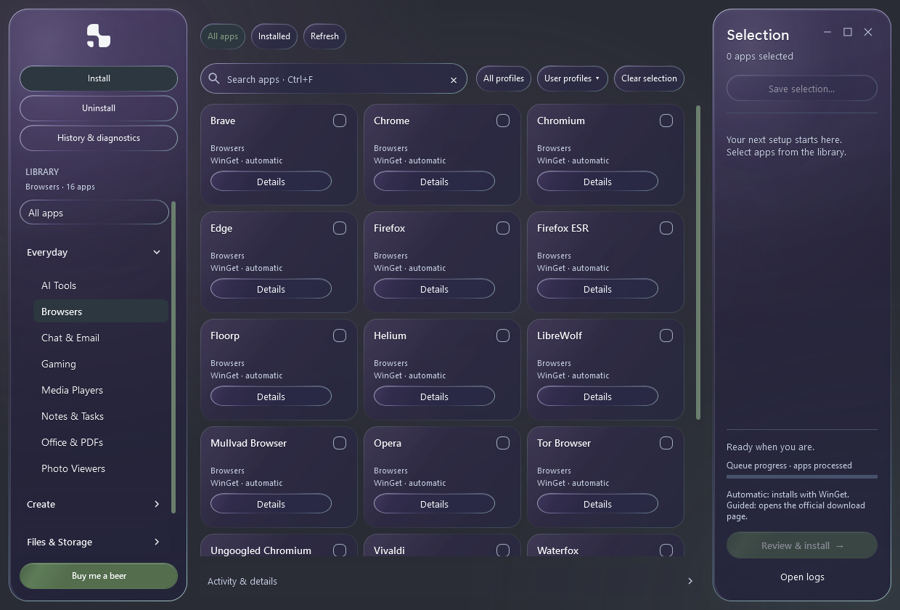
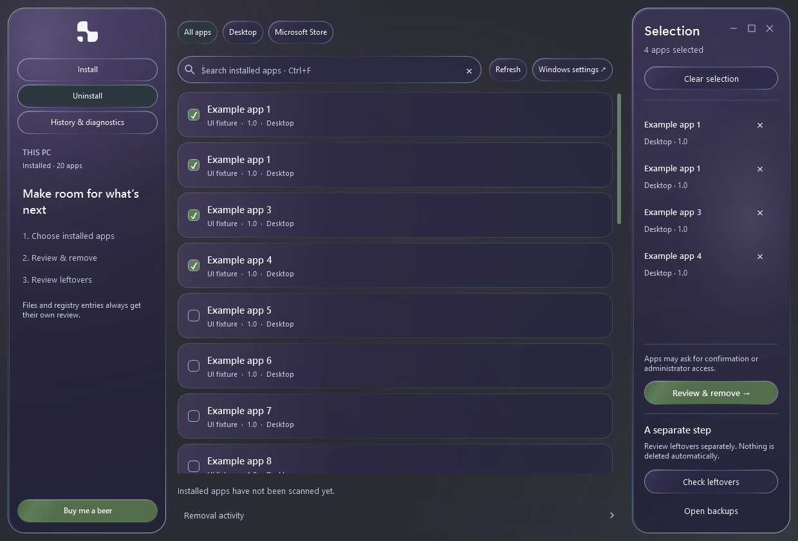

# 1nstall

A Windows app manager for choosing, installing and removing your software. Browse a task-based library, start with a profile, and review each operation before it runs.

**325 apps · 24 categories · 20 profiles · Windows x64**

[**Download 1nstall 3.2**](https://github.com/braga1k/1nstall/releases/latest/download/1nstall.exe) · [Windows ZIP](https://github.com/braga1k/1nstall/releases/download/v3.2.0/1nstall-3.2.0-Windows-x64.zip) · [Release notes](https://github.com/braga1k/1nstall/releases/tag/v3.2.0) · [Checksums](https://github.com/braga1k/1nstall/releases/download/v3.2.0/SHA256SUMS.txt) · [Buy me a beer](https://ko-fi.com/braga1k)



## Choose your apps

- **Install:** 277 apps use WinGet; 48 open the publisher's official download page for guided installation. Compact cards keep the library visible; descriptions, license information and installed status live in Details.
- **Profiles:** 20 setups for everyday work, creative projects, files, privacy and development. Save your own selection or preview an installed-app snapshot on another PC.
- **Uninstall:** search registered desktop and current-user Microsoft Store apps, review your selection and run the original uninstallers in sequence.
- **Selection:** both modes list the selected apps with individual × controls. Clear selection also clears their checkboxes. Nothing starts until you review and confirm.
- **History & diagnostics:** per-app outcomes, detailed logs, applicable retries and a diagnostic preview you can review before saving.
- **Leftovers:** separately review supported folders and registry traces after removal. Cleanup requires explicit consent; registry changes require backups and folders go to Recycle Bin.

The interface uses glass panels, your Windows accent, smooth transitions and the new 1nstall symbol. Windows transparency, high contrast and reduced-motion preferences are respected. Install and Uninstall share consistent search controls and full-height Selection panels.

## Get started

1. Download **1nstall.exe**, or extract the Windows ZIP, and open it.
2. Under **Install**, choose apps or a profile and adjust the **Selection** panel.
3. Choose **Review & install**, check the plan and start the queue. Complete guided publisher downloads yourself.
4. To remove software, open **Uninstall**, select apps and choose **Review & remove**. Review leftovers separately after removal.

The standalone executable includes the interface, catalog, helpers and license notices. No source folder, Python or Zig is required to run it. The release is unsigned; checksums accompany the downloads.

### Requirements

- Windows 10 or 11, **64-bit**, with Windows PowerShell 5.1, WPF and .NET Framework 4.x.
- WinGet from Windows App Installer for automatic installation; internet access for downloads.
- Full installed-package awareness requires PowerShell 7 in its standard Program Files location and Microsoft.WinGet.Client 1.7 or later. Without these, WinGet export can confirm some identities; omitted apps remain Unknown. Automatic catalog installation remains available through WinGet.
- Individual installers and machine-level removals may request administrator access.

Native Desktop Acrylic requires supported Windows 11 builds; older systems and disabled transparency use opaque surfaces. See [validation and current limits](docs/VALIDATION.md) for coverage of Windows versions, accessibility and native operations.

## What's new in 3.2

- A centered vector logo and a new violet-and-sage Windows icon.
- Symmetrical sidebars, clearer categories, smooth text and matching toolbars in both modes.
- Compact, stable app cards and integrated Details windows; numbers sort first, letters next and symbol-prefixed names last.
- Selected apps appear in both Selection panels; Uninstall's Clear selection reliably updates the list.
- Compiled interface and helpers, in-process PowerShell, background preparation and cached JIT startup while retaining animations.
- Installed awareness, portable setup snapshots and operation history from the review build.
- Essentials and the Update Center have been removed. 3.2 focuses on installation, removal and selection management.

[Full changelog](CHANGELOG.md) · [3.2 release notes](docs/releases/3.2.0.md)

## Profiles and portable selections

Choose a profile from **All profiles**. Choosing one replaces the selection; it never starts installation. Save it with **Selection > Save selection...** or **User profiles > Save current selection...**, then load it on another PC.

Snapshots restore selections, not personal files, settings, credentials or guaranteed identical versions. Imports preview installed, missing, unavailable and manual entries. Existing selection profiles remain compatible when their app keys are in the catalog.

[Profiles](docs/PROFILES.md) · [Supported applications](docs/SUPPORTED-APPS.md) · [Category review](docs/CATEGORY-REVIEW.md)

## Remove apps and review leftovers



Missing or unsupported uninstallers point to Windows Settings. Stop lets the current uninstaller finish before stopping the queue. A separate leftover review follows verified removal; nothing is selected or deleted automatically.

Cleanup excludes protected locations, personal documents, broad vendor roots, shared registrations, links and uncertain ownership. Restart-dependent cleanup waits for a later boot. Registry exports are available under **Open backups**; recycled folders can be restored through Windows Recycle Bin. Detection is bounded and does not find every trace of every app.

[Removal scope and recovery](docs/UNINSTALL.md)

## Run or build from source

Download the source ZIP, extract it and double-click `script_allower.cmd`, or run:

```powershell
powershell.exe -NoProfile -STA -ExecutionPolicy Bypass -File .\vexan_installers.ps1
```

Keep the catalog, profiles, interface and `src/` beside the script. The execution-policy option affects only that process. Build the standalone application with Windows' .NET Framework compiler and MSBuild:

```powershell
powershell.exe -NoProfile -ExecutionPolicy Bypass -File .\build-windows.ps1
```

The output is `dist/1nstall.exe`. Rebuild after changing embedded source, data, interface, icon or notices. Verified assemblies and the startup profile are cached in `%LOCALAPPDATA%\1nstall\Runtime`. The alternate Python/Zig builder retains the slower script launcher and is not the release builder. Rebuild the icon with `build-brand.ps1`.

## Validation

```powershell
python tests/catalog.py
powershell.exe -NoProfile -STA -ExecutionPolicy Bypass -File .\tests\reliability.ps1
powershell.exe -NoProfile -STA -ExecutionPolicy Bypass -File .\vexan_installers.ps1 -ManagerTest -PreviewPath preview.png
powershell.exe -NoProfile -STA -ExecutionPolicy Bypass -File .\tests\smoke.ps1
powershell.exe -NoProfile -STA -ExecutionPolicy Bypass -File .\tests\startup.ps1
```

The executable also accepts `--self-test`, `--smoke-test` and `--manager-test`. Windows CI runs catalog, headless reliability and packaged self-tests before publishing, then verifies the uploaded asset hashes. WPF tests use fictional apps and do not install or remove personal software.

Current local UI tests cover responsive cards, Details, search, selection synchronization, duplicate names, profiles, keyboard focus, glass and reduced-motion fallbacks. Startup measurements vary: this environment measured roughly 3.2 seconds in the final comparison; 1–2 seconds is not guaranteed. Publisher installers, Store removal, elevation, restart flows and physical accessibility/DPI checks need broader end-to-end coverage. [Full evidence and limitations](docs/VALIDATION.md).

## Troubleshooting

| Problem | What to check |
| --- | --- |
| Automatic installation unavailable | Install/update Windows App Installer, then reopen 1nstall. |
| Installation or removal failed | Inspect Activity & details, Removal activity and History & diagnostics. |
| A guided app was not installed | Complete the official download and installer opened by the app. |
| No leftovers offered | Check the scan result. Detection is intentionally limited to supported, verified candidates. |
| A saved profile will not load | Its keys must exist in this catalog; rejected imports preserve your selection. |
| App cannot start | Check `%TEMP%\1nstall-startup-error.log`. |

Logs: `%LOCALAPPDATA%\1nstall\Logs`. Backups: `%LOCALAPPDATA%\1nstall\Backups`. Review diagnostic exports before sharing; raw logs may contain personal paths.

## Contributions and credits

[Report an issue](https://github.com/braga1k/1nstall/issues) with your app/Windows version and reproduction steps. App suggestions should include an official website, installation method, license and category. [Buy me a beer](https://ko-fi.com/braga1k) supports the project.

The catalog takes inspiration from [WinUtil](https://github.com/ChrisTitusTech/winutil); [recorded coverage](docs/WINUTIL-COVERAGE.json) identifies the reviewed snapshot. Installation uses [Microsoft WinGet](https://github.com/microsoft/winget-cli).

Selected AppCompat/UserAssist scanners and ROT13 handling are adapted from [Bulk Crap Uninstaller](https://github.com/BCUninstaller/Bulk-Crap-Uninstaller) under Apache-2.0. Full license, upstream NOTICE and modifications are included in [third-party notices](licenses/THIRD-PARTY-NOTICES.txt) and **History & diagnostics > Licenses & credits**. 1nstall does not reproduce every BCU provider.

Third-party apps retain their own licenses and account requirements. The project does not currently declare a general license for its original code.
