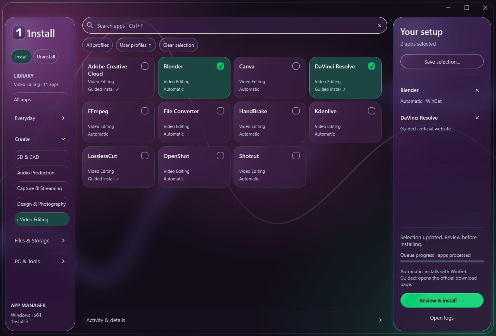

# Revisão das categorias e cobertura

Revisão de 1 de outubro de 2026. Público: utilizador comum, incluindo referências profissionais importantes.

As 325 apps foram revistas. A navegação passa de 14 categorias genéricas para 24 categorias de tarefa, distribuídas por quatro grupos expansíveis. Existem 214 alterações de categoria principal, incluindo renomeações; isso não significa que 214 apps estivessem erradas. Treze associações secundárias permitem encontrar ferramentas multifunções sem duplicar a app nem a instalação. O catálogo mantém 277 entradas automáticas, 48 guiadas e os oito perfis.

## O problema e a regra usada

“Audio & Video” misturava ouvir música, editar filmes, gravar o ecrã e instalar codecs. “Internet” juntava acesso remoto, SSH e ferramentas de rede. “System” incluía ficheiros, drivers, personalização e runtimes. Estes nomes obrigavam o utilizador a conhecer a classificação técnica antes de encontrar uma ferramenta.

A categoria principal responde à tarefa principal. A categoria secundária só existe para uma tarefa autónoma e relevante; exportar um formato ou ter uma função acessória não basta. Os grupos ajudam a percorrer a lista e não são filtros exclusivos. “All apps” e a pesquisa continuam disponíveis. Os nomes da interface permanecem em inglês, como o resto da app.

| Grupo | Categoria | Tarefa | Principal / visíveis |
|---|---|---|---|
| Everyday | Browsers | Navegar na Web | 16 / 16 |
| Everyday | Chat & Email | Mensagens, email e reuniões | 23 / 23 |
| Everyday | Office & PDFs | Documentos, folhas de cálculo, PDFs e leitura | 17 / 17 |
| Everyday | Notes & Tasks | Notas, tarefas e organização pessoal | 11 / 11 |
| Everyday | AI Tools | Assistentes e modelos locais | 3 / 3 |
| Everyday | Media Players | Ouvir música e ver vídeos | 15 / 16 |
| Everyday | Photo Viewers | Ver e organizar imagens | 6 / 6 |
| Everyday | Gaming | Jogos, launchers, emulação e streaming de jogos | 22 / 23 |
| Create | Video Editing | Editar, cortar, converter e compor vídeo | 7 / 11 |
| Create | Audio Production | Gravar, editar, compor e misturar áudio | 4 / 6 |
| Create | Capture & Streaming | Capturas, gravação de ecrã e transmissões | 4 / 4 |
| Create | Design & Photography | Design, desenho e tratamento de fotografias | 10 / 11 |
| Create | 3D & CAD | Modelação, CAD e preparação de impressão 3D | 6 / 6 |
| Files & Storage | Files & Downloads | Ficheiros, arquivos, transferências e downloads | 23 / 23 |
| Files & Storage | Cloud & Backup | Sincronização, cloud e cópias de segurança | 9 / 9 |
| Files & Storage | Media Servers | Servir bibliotecas pessoais a outros dispositivos | 2 / 2 |
| Files & Storage | Security & Privacy | Passwords, encriptação, proteção e VPN de privacidade | 14 / 16 |
| PC & Tools | Remote Access | Controlar computadores e partilhar periféricos | 7 / 9 |
| PC & Tools | Network Tools | Diagnóstico, SSH e infraestrutura de rede | 11 / 11 |
| PC & Tools | Development | Código, IDEs, SDKs, APIs, bases de dados e motores de jogos | 55 / 55 |
| PC & Tools | Windows Utilities | Personalização, automação e manutenção do Windows | 29 / 29 |
| PC & Tools | Hardware & Drivers | Drivers, periféricos, sensores, RGB e diagnóstico | 21 / 21 |
| PC & Tools | Audio Controls | Volume, equalização e encaminhamento de som | 3 / 3 |
| PC & Tools | Runtimes | Componentes necessários para executar outras apps | 7 / 7 |

As contagens principais somam 325. As visíveis incluem associações secundárias. [Definições e exclusões completas](CATEGORY-TAXONOMY.json) e [revisão individual das 325 apps](CATEGORY-AUDIT.csv).

## Casos que exigiram uma decisão

| Aplicação / família | Decisão | Motivo |
|---|---|---|
| DaVinci Resolve | Video Editing | Edição, cor, efeitos e pós-produção de áudio são o produto principal; não é um player. |
| VLC, Spotify, MusicBee | Media Players | Consumo de vídeo/música, independentemente de ficheiro local ou streaming. |
| Audacity, REAPER, FL Studio, MuseScore | Audio Production | Edição, gravação e criação musical. |
| OBS, ShareX, Greenshot | Capture & Streaming | Captura/gravação/transmissão; pós-produção é uma tarefa diferente. |
| Blender | 3D & CAD; também Video Editing | Modelação continua principal, mas o sequenciador oferece edição de vídeo real. |
| Adobe Creative Cloud | Design & Photography; também Video Editing e Audio Production | Uma rota de instalação para várias ferramentas; não promete instalação nem licença de cada produto. |
| Canva | Design & Photography; também Video Editing | Tem um editor de vídeo com timeline além do design. |
| ComfyUI | AI Tools; também Design & Photography | Workflows de IA e criação visual. |
| FFmpeg / File Converter | Video Editing / Files & Downloads; associações secundárias | FFmpeg também processa áudio; File Converter tem um workflow relevante de conversão de vídeo. |
| EarTrumpet, Equalizer APO, Peace | Audio Controls | Volume/EQ do sistema, separados da criação musical. A dependência Peace → APO permanece. |
| Jellyfin / Plex Server | Media Servers | Hospedar bibliotecas; clientes continuam em Media Players. |
| Parsec, Moonlight, Sunshine | Acesso remoto / jogos, conforme a tarefa principal | Categorias secundárias preservam os dois contextos de controlo e streaming. |
| OneDrive, Syncthing, FreeFileSync | Cloud & Backup | Sincronização e proteção de dados, separados de downloads e arquivos. |
| AnyDesk, TeamViewer, Deskflow | Remote Access | Controlo remoto/partilha de entrada, separados de ferramentas de rede. |
| OpenVPN / WireGuard | Network Tools; também Security & Privacy | Infraestrutura de rede com uma tarefa de segurança relevante; VPNs comerciais de privacidade ficam em Security & Privacy. |
| CPU-Z, CrystalDiskInfo, RGB e drivers | Hardware & Drivers | Diagnóstico e configuração de equipamentos. |
| .NET Desktop, Visual C++, DirectX, K-Lite | Runtimes | Componentes de execução. K-Lite também aparece em Media Players por incluir um player no pacote Standard. JDKs e SDKs continuam em Development. |

As decisões multifunções apoiam-se nas páginas dos fabricantes: [DaVinci Resolve](https://www.blackmagicdesign.com/products/davinciresolve), [Blender](https://www.blender.org/features/video-editing/), [Creative Cloud](https://www.adobe.com/creativecloud.html), [Canva](https://www.canva.com/video-editor/), [OBS](https://obsproject.com/) e [Jellyfin](https://jellyfin.org/docs/general/quick-start/). As restantes linhas da auditoria identificam a descrição/metadados existentes ou a fonte consultada; não representam uma nova instalação de cada app.

## Comparação até 50 por categoria

Não apresentamos estas posições como um ranking medido de utilização. A comparação editorial combina o catálogo atual, um snapshot de 570 produtos do [Patch My PC Home Updater](https://patchmypc.com/product/home-updater/), o contexto de seleção do [Ninite](https://ninite.com/) e verificações específicas nos fabricantes. Uma lista de atualização comprova um sinal de distribuição Windows, não popularidade nem manutenção contínua. Os [manifests WinGet](https://github.com/microsoft/winget-pkgs) ajudam a avaliar a próxima integração, não são prova de utilização.

A matriz contém 911 relações app/categoria e 894 nomes distintos. Há 564 nomes ausentes: 202 têm uma fonte de distribuição ou fabricante consultada e 362 são pistas por verificar. Estes últimos constam como “Candidate; publisher/Windows verification pending”, sem uma URL apresentada como verificada. Não são recomendações de inclusão. Adobe Bridge/Media Encoder precisam de confirmar a cobertura/licença da rota Creative Cloud antes de contar como lacuna independente.

Categorias pequenas ficam abaixo de 50. Development já tem 55 entradas: a comparação limitada a 50 não inclui todas, e a auditoria de 325 apps é a referência para a cobertura completa. Nenhuma app ausente foi adicionada nesta revisão. “Windows/vendor-provided” significa verificar a disponibilidade na máquina; não garante pré-instalação em todas as versões.

| Categoria | Linhas | Presentes | Suite / plataforma | Ausentes | Ausentes por verificar |
|---|---|---|---|---|---|
| Browsers | 24 | 16 | 0 / 0 | 8 | 0 |
| Chat & Email | 37 | 23 | 0 / 0 | 14 | 10 |
| Office & PDFs | 45 | 17 | 0 / 0 | 28 | 18 |
| Notes & Tasks | 37 | 11 | 0 / 0 | 26 | 20 |
| AI Tools | 19 | 3 | 0 / 0 | 16 | 12 |
| Media Players | 41 | 16 | 0 / 0 | 25 | 19 |
| Photo Viewers | 19 | 6 | 0 / 0 | 13 | 11 |
| Gaming | 41 | 23 | 0 / 0 | 18 | 13 |
| Video Editing | 48 | 11 | 2 / 1 | 34 | 14 |
| Audio Production | 50 | 6 | 1 / 0 | 43 | 29 |
| Capture & Streaming | 32 | 4 | 0 / 0 | 28 | 21 |
| Design & Photography | 48 | 11 | 4 / 0 | 33 | 26 |
| 3D & CAD | 50 | 6 | 0 / 0 | 44 | 40 |
| Files & Downloads | 50 | 23 | 0 / 0 | 27 | 5 |
| Cloud & Backup | 42 | 9 | 0 / 0 | 33 | 26 |
| Media Servers | 12 | 2 | 0 / 0 | 10 | 8 |
| Security & Privacy | 50 | 16 | 0 / 1 | 33 | 14 |
| Remote Access | 34 | 9 | 0 / 1 | 24 | 17 |
| Network Tools | 47 | 11 | 0 / 1 | 35 | 30 |
| Development | 50 | 46 | 0 / 0 | 4 | 0 |
| Windows Utilities | 50 | 29 | 0 / 1 | 20 | 1 |
| Hardware & Drivers | 50 | 21 | 0 / 0 | 29 | 15 |
| Audio Controls | 19 | 3 | 0 / 1 | 15 | 10 |
| Runtimes | 16 | 7 | 1 / 1 | 7 | 5 |

[Matriz completa com presença, prioridade, fonte e ressalvas](CATEGORY-COVERAGE.csv) · [Método e resumo](CATEGORY-COVERAGE.json).

## Lacunas com melhor justificação para a próxima integração

Esta é uma seleção de prioridades, não uma proposta de adicionar todos os ausentes. As referências profissionais complementam a cobertura quotidiana. A coluna Audience da matriz distingue workflows quotidianos/criativos, referências profissionais, usos especializados/ocasionais e compatibilidade; são classificações editoriais, não estatísticas de utilização.

| Área | Candidatos confirmados | Condição de integração |
|---|---|---|
| Vídeo acessível | [CapCut](https://www.capcut.com/resource/capcut-for-windows), [Shutter Encoder](https://www.shutterencoder.com/) | Rever instalador, conta/licença e package ID. [Clipchamp](https://clipchamp.com/en/windows-video-editor/) pode já estar disponível no Windows. |
| Música profissional | [Ableton Live](https://help.ableton.com/hc/en-us/articles/209775965-Windows-Compatibility-with-Live), [Bitwig Studio](https://www.bitwig.com/download/), [Fender Studio Pro](https://www.fender.com/pages/fender-studio-pro), [Cakewalk Sonar](https://www.cakewalk.com/sonar) | Contas, licenças e instalação guiada; Studio One mudou de marca, evitar duplicação. |
| Áudio simples | [ocenaudio](https://www.ocenaudio.com/download) | Alternativa focada na edição de áudio. |
| IA local | [Ollama](https://ollama.com/download/windows), [LM Studio](https://lmstudio.ai/download) | Rever requisitos, modelos e espaço em disco; não instalar modelos implicitamente. |
| Notas privadas | [Standard Notes](https://standardnotes.com/download), [Logseq](https://github.com/logseq/logseq/releases) | Logseq tem edições/beta distintas; decidir versão antes de integrar. |
| Hardware | [FanControl](https://getfancontrol.com/) | Compatibilidade com controladores/sensores; não configurar ventoinhas automaticamente. |
| Impressão e eletrónica | [PrusaSlicer](https://www.prusa3d.com/p/prusaslicer/), [OrcaSlicer](https://github.com/OrcaSlicer/OrcaSlicer), [KiCad](https://www.kicad.org/download/windows/) | Prioridade para o público com impressora 3D ou trabalho de PCB; manter fora dos perfis gerais. |
| Backup | [Duplicati](https://duplicati.com/download), [Veeam Agent](https://www.veeam.com/products/free/microsoft-windows.html) | Instalação não cria nem valida uma estratégia de backup. |
| Controlo de som | [FxSound](https://www.fxsound.com/download), [SoundSwitch](https://github.com/Belphemur/SoundSwitch), [Voicemeeter](https://vb-audio.com/Voicemeeter/) | Voicemeeter instala dispositivos virtuais e pede reinício/admin; prioridade especializada. |
| Servidores | [Emby Server](https://emby.media/download.html), [Universal Media Server](https://www.universalmediaserver.com/) | Alternativas ocasionais; clientes, servidor e extras licenciados são distintos. |
| Desenvolvimento profissional | [Rider](https://www.jetbrains.com/rider/download/), [DataGrip](https://www.jetbrains.com/datagrip/download/), [Insomnia](https://insomnia.rest/download), [RStudio](https://docs.posit.co/ide/user/) | Rever licenças e dependências; o RStudio atual exige Windows 11. |
| Gaming | [RetroArch](https://www.retroarch.com/?page=platforms), [Dolphin](https://dolphin-emu.org/download/), [PPSSPP](https://www.ppsspp.org/download/) | Emulação é opcional e não implica jogos incluídos; rever dependências. |

ScreenToGif, Streamlabs Desktop, Bandizip, FreeCommander XE, JDownloader 2, NVDA e Auto Dark Mode são candidatos práticos com sinal na lista de distribuição; falta validar individualmente package ID, fonte oficial, licença e processo antes de os adicionar. Ferramentas CAD avançadas, soluções empresariais e utilitários de compatibilidade ficam como investigação especializada na matriz.

## Validação da navegação

Os checks automatizados verificam categorias, grupos, associações, referências e os filtros reais de WPF. O teste de vídeo exige Resolve, Blender e Creative Cloud visíveis e VLC oculto; a seleção mantém a mesma chave entre categorias. A suíte cobre dependências, perfis e grelha responsiva. Os testes Python 3.13 e WPF passaram; as capturas foram inspecionadas a 980 e 1240 DIPs, com checks também a 1060 e 1500. O modo opaco é exercitado sem alterar as definições do sistema, e o contraste de texto é calculado sobre pixels do fundo renderizado. A preferência de transparência é lida através de [UISettings.AdvancedEffectsEnabled](https://learn.microsoft.com/en-us/uwp/api/windows.ui.viewmanagement.uisettings.advancedeffectsenabled).

A clareza foi avaliada por tarefa e inspeção da interface; ainda não foi testada com utilizadores. Para validar, aplicar um teste de árvore com cinco a oito pessoas e tarefas sem nomes de categorias: ver um filme; editar vídeo; gravar o ecrã; equalizar os headphones; sincronizar pastas; ajudar remotamente um familiar; instalar um driver; preparar uma impressão 3D. Registar primeiro caminho, sucesso sem ajuda e hesitações, rever sobretudo os grupos Files & Storage e PC & Tools. O [método de tree testing](https://www.nngroup.com/articles/tree-testing/) permite testar a estrutura sem depender da estética.

Instalações de terceiros, licenças comerciais, Windows 10 e definição de popularidade real não foram validados por esta revisão. A interface 3.1, agora com a marca 1nstall, usa esta taxonomia e o redesign inspirado nas referências de Liquid Glass. As superfícies em WPF usam gradientes, transparência e sombras; não implementam refração óptica nem o material nativo da Apple.
