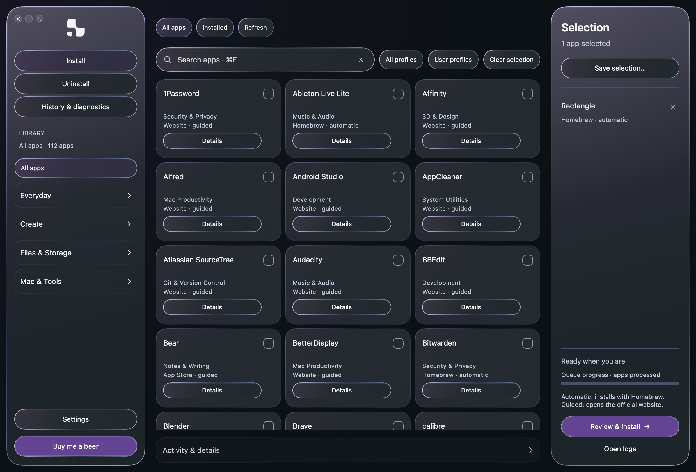
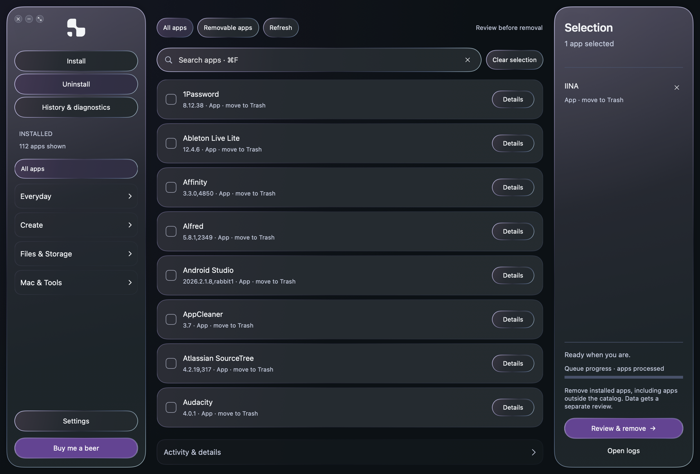

# 1nstall for Mac — 0.5.0 beta 1

A native SwiftUI/AppKit beta inspired by the Windows 3.5 experience, with a Mac-specific library and a list-based Uninstall view.

**112 apps · 25 categories · 20 profiles · English and Portuguese (Portugal)**

## Download and start

Download `1nstall-mac-0.5.0-beta.1-arm64.zip` from the [Mac beta release](https://github.com/braga1k/1nstall/releases/tag/mac-v0.5.0-beta.1). Extract it and move `1nstall Mac Preview.app` to your Applications folder. The existing preview name and bundle identifier are retained so local preferences and history carry forward.

- Apple Silicon only. The declared deployment target is macOS 14; this beta was validated on an M4 Pro running macOS Tahoe 26.5.2. Other supported versions still need testing.
- This build has an **ad hoc signature, no Developer ID signature and no Apple notarization**. macOS may block the downloaded app. Review [Apple's guidance for apps from outside the App Store](https://support.apple.com/en-nz/102445) and decide whether to open it. No security settings are changed by the app or installer.
- Homebrew is required for the 33 automatic catalog installations. The other 79 entries open an official source. Homebrew is not bundled or installed automatically.
- Third-party apps may require payment, subscriptions or accounts. Their current requirements and licences still apply.

Compare the ZIP's SHA-256 with `SHA256SUMS.txt` in the release. Source is included separately and in the release tag. There is no automatic updater for this Mac beta.

## What works

Browse and search the Mac library, choose categories and profiles, review a selection, then follow the per-app queue through preparation, installation/removal and verification. Results survive refresh and restart. The full pill, card or row receives clicks. Navigation remains interactive during the entrance animation.

The interface offers light/dark/system appearance, optional accent, monochrome gradients, pointer light, smooth transitions and reduced motion. Uninstall uses a vertical list. All screenshots use English and fictional removal examples.

Removal discovers installed apps independently of the catalog. Ordinary apps go to Trash, verified Homebrew installations use their recorded removal instructions, and permission-limited native removal can request macOS administrator authorization. Protected moves go to **1nstall Recovery**, with app restoration from History. The helper handles one reviewed request and exits; it does not install a permanent daemon or accept arbitrary shell commands.

Review associated preferences, caches, support data and identified containers separately. Personal content and shared resources are distinguished; nothing is selected automatically. Counts and logical sizes come from measured items. Moving items to Trash or Recovery does **not** immediately free disk space.

## Validation and limits

47 core checks, 10 interface-state checks and 11 rendering/motion checks passed locally. All 33 automatic entries passed metadata preflight. Maccy and Skim passed disposable installation, identity/arm64 verification and recorded Homebrew removal. Earlier Rectangle/IINA cycles and native administrator removal, app restoration and system-cache recovery are documented separately. No personal app was a test target.

24 English fixture captures cover four appearances and constrained windows; eight monochrome captures passed the RGB neutrality check. [Windows/Mac visual comparison](docs/images/comparison.png). This is not pixel-identical to Windows and is not a new FPS benchmark.

This beta **does not yet match every Mole removal scenario**. External privileged helpers, system extensions, PKG receipts and specialized uninstallers still need dedicated support. Some resources remain protected. A verified app-bundle removal does not mean every component or personal file was removed. App-data restoration from Recovery is currently manual, and stopped-service restoration after a partial failure remains incomplete.

The catalog is curated metadata, not 112 live installation tests. 35 entries still require source confirmation of the minimum macOS version. Firefox remains an official download because its checksums vary by language; Vivaldi remains an official download because the reviewed API versions differed. Final Cut Pro and Motion currently require a newer macOS than the validation machine. Changed automatic casks are refused until reviewed again.

[Catalog and sources](docs/SUPPORTED-APPS.md) · [Removal matrix (PT-PT)](docs/REMOVAL.md) · [Validation evidence (PT-PT)](docs/VALIDATION.md) · [Build instructions (PT-PT)](README.md)

## Feedback and recovery

[Report an issue](https://github.com/braga1k/1nstall/issues) with this beta version, macOS version and reproduction steps. Review logs before sharing: they may contain personal paths. Preferences, history and operation logs stay local. The app does not upload them.

State and recovery records live in `~/Library/Application Support/1nstall-mac-preview/`. Keep its `Recovery` folder while it contains items you may need. Restoring protected apps may require administrator authorization again; existing files are never intentionally overwritten.

Mole was studied at commit `42b7b8d4c0331fed9c9c01480ec448ef23aabbdd` under GPL-3.0. No Mole source or binaries are included in this implementation. Third-party apps retain their own licences. This repository does not currently declare a general licence for its original code.
